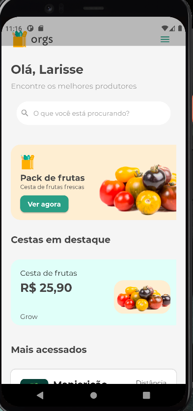

<p align="center">
  app
</p>
<h1 align="center">
    
</h1>
<br>

## 🧪 Tecnologias

Esse projeto foi desenvolvido com as seguintes tecnologias:

- [Flutter](https://flutter.dev/)

## 🚀 Como executar

Clone o projeto e acesse a pasta do mesmo.

```
$ git clone https://github.com/LarisseLima/navigator_flutter
$ cd navigator_flutter

```
 - Para instalar as dependências:
   $ flutter pub get

   - Rodar o  app: 
   $ flutter run
```

## 📝 License

Esse projeto está sob a licença MIT. Veja o arquivo [LICENSE]() para mais detalhes.

---
  >Esse projeto foi desenvolvido com :coffee: por **[@Larisse Lima](https://www.linkedin.com/in/larisselima/)**

